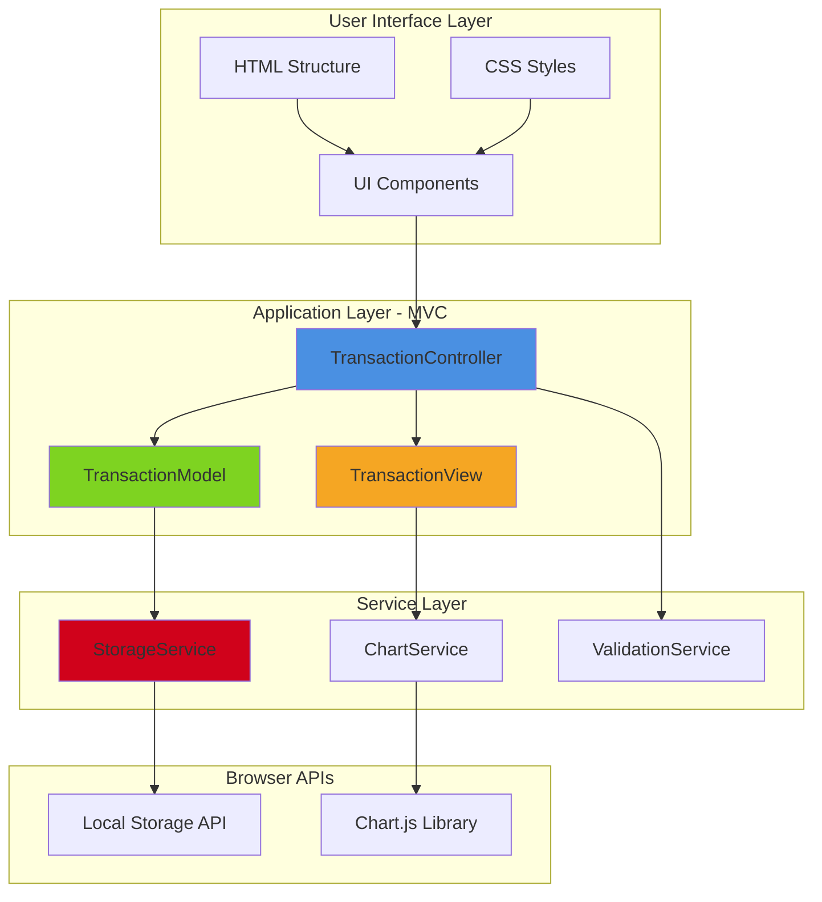
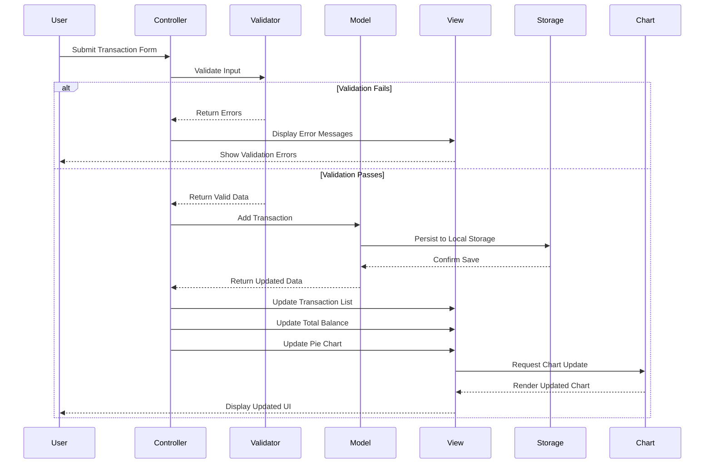
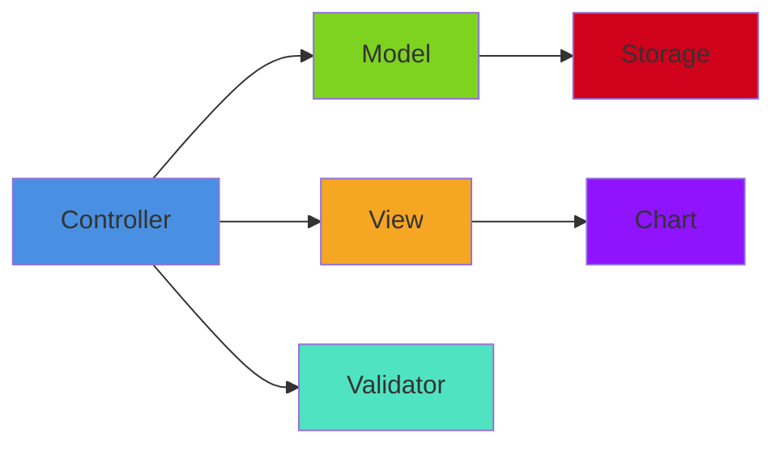

# Design Document: Expense & Budget Visualizer MVP

## Overview

The Expense & Budget Visualizer MVP is a client-side web application that enables users to track expenses and visualize spending patterns through a pie chart. The system operates entirely in the browser using Local Storage for data persistence, requiring no backend server infrastructure.

### Core Features
1. **Transaction Input** - Form to add expense transactions with name, amount, and category
2. **Transaction List** - Scrollable display of all transactions with delete capability
3. **Balance Display** - Real-time total of all expenses
4. **Pie Chart Visualization** - Category-based expense distribution using Chart.js
5. **Data Persistence** - Browser Local Storage for data retention across sessions
6. **Error Handling** - User-friendly validation and error messaging

### Technical Stack
- **Frontend**: HTML5, CSS3, Vanilla JavaScript (ES6+)
- **Visualization**: Chart.js 4.x (via CDN)
- **Storage**: Browser Local Storage API
- **Architecture**: MVC (Model-View-Controller) pattern

### Design Principles
- Single-page application with no page reloads
- Mobile-first responsive design
- Progressive enhancement approach
- Accessibility-first UI components
- Graceful degradation for storage errors

## Architecture

### System Architecture Diagram



### MVC Pattern Implementation

**Model (Data Layer)**
- `TransactionModel`: Manages transaction data and business logic
- Handles CRUD operations for transactions
- Maintains in-memory transaction collection
- Syncs with StorageService for persistence

**View (Presentation Layer)**
- `TransactionView`: Handles all DOM manipulation and rendering
- Updates transaction list display
- Renders total balance
- Updates chart visualization
- Displays error and success messages

**Controller (Logic Layer)**
- `TransactionController`: Orchestrates user interactions
- Connects Model and View
- Handles form submissions
- Manages deletion events
- Coordinates data flow between components

### Component Interaction Flow



## Components and Interfaces

### 1. TransactionModel

**Responsibilities:**
- Maintain transaction collection in memory
- Provide CRUD operations for transactions
- Generate unique IDs for new transactions
- Calculate aggregate values (totals, category sums)

**Interface:**
```javascript
class TransactionModel {
  constructor(storageService)
  
  // Core CRUD operations
  addTransaction(transaction): Transaction
  getTransactions(): Transaction[]
  getTransactionById(id): Transaction | null
  deleteTransaction(id): boolean
  
  // Aggregate calculations
  getTotalBalance(): number
  getCategoryTotals(): Map<string, number>
  
  // Data management
  loadFromStorage(): void
  clearAllTransactions(): void
}
```

**Properties:**
```javascript
{
  transactions: Transaction[],     // In-memory transaction array
  storageService: StorageService,  // Reference to storage service
  nextId: number                   // Auto-increment ID counter
}
```

### 2. TransactionView

**Responsibilities:**
- Render transaction list to DOM
- Update total balance display
- Manage form state and validation messages
- Coordinate chart rendering
- Display user feedback (errors, success messages)

**Interface:**
```javascript
class TransactionView {
  constructor(chartService)
  
  // Rendering methods
  renderTransactions(transactions): void
  renderTotalBalance(total): void
  updateChart(categoryTotals): void
  
  // UI state management
  clearForm(): void
  showError(field, message): void
  clearErrors(): void
  showSuccess(message): void
  
  // Event binding
  bindAddTransaction(handler): void
  bindDeleteTransaction(handler): void
  
  // Getters for form values
  getFormValues(): {name: string, amount: number, category: string}
}
```

**DOM Element References:**
```javascript
{
  form: HTMLFormElement,
  nameInput: HTMLInputElement,
  amountInput: HTMLInputElement,
  categorySelect: HTMLSelectElement,
  transactionList: HTMLElement,
  totalDisplay: HTMLElement,
  chartCanvas: HTMLCanvasElement,
  errorContainer: HTMLElement
}
```

### 3. TransactionController

**Responsibilities:**
- Initialize application on page load
- Handle user interactions
- Coordinate Model and View updates
- Validate user input before processing
- Manage application state

**Interface:**
```javascript
class TransactionController {
  constructor(model, view, validator)
  
  // Initialization
  init(): void
  
  // Event handlers
  handleAddTransaction(): void
  handleDeleteTransaction(id): void
  
  // Private coordination methods
  _updateView(): void
  _refreshChart(): void
}
```

### 4. StorageService

**Responsibilities:**
- Abstract Local Storage API
- Handle JSON serialization/deserialization
- Manage storage errors gracefully
- Provide storage availability checks

**Interface:**
```javascript
class StorageService {
  constructor(storageKey)
  
  // Storage operations
  save(data): boolean
  load(): any | null
  clear(): boolean
  isAvailable(): boolean
  
  // Error handling
  getLastError(): Error | null
}
```

**Storage Schema:**
```javascript
{
  version: "1.0",
  lastModified: "ISO 8601 timestamp",
  transactions: [
    {
      id: number,
      name: string,
      amount: number,
      category: string,
      createdAt: "ISO 8601 timestamp"
    }
  ],
  settings: {
    nextId: number
  }
}
```

### 5. ChartService

**Responsibilities:**
- Initialize Chart.js pie chart
- Update chart data dynamically
- Handle chart responsiveness
- Manage chart color scheme

**Interface:**
```javascript
class ChartService {
  constructor(canvasElement, chartConfig)
  
  // Chart operations
  initialize(): void
  updateData(categoryTotals): void
  destroy(): void
  
  // Configuration
  setColors(colorMap): void
}
```

**Chart Configuration:**
```javascript
{
  type: 'pie',
  data: {
    labels: string[],      // Category names
    datasets: [{
      data: number[],      // Category totals
      backgroundColor: string[]  // Category colors
    }]
  },
  options: {
    responsive: true,
    maintainAspectRatio: true,
    plugins: {
      legend: {
        position: 'bottom',
        labels: {
          padding: 15,
          font: { size: 14 }
        }
      },
      tooltip: {
        callbacks: {
          label: function(context) {
            // Format: "Category: $amount (percentage%)"
          }
        }
      }
    }
  }
}
```

### 6. ValidationService

**Responsibilities:**
- Validate transaction input fields
- Provide descriptive error messages
- Sanitize user input

**Interface:**
```javascript
class ValidationService {
  // Field validation
  validateName(name): ValidationResult
  validateAmount(amount): ValidationResult
  validateCategory(category): ValidationResult
  
  // Complete form validation
  validateTransaction(transaction): ValidationResult
  
  // Utility methods
  sanitizeInput(input): string
}
```

**ValidationResult Type:**
```javascript
{
  valid: boolean,
  errors: {
    field: string,
    message: string
  }[]
}
```

### Component Dependency Graph



## Data Models

### Transaction Object

**Structure:**
```javascript
{
  id: number,           // Unique identifier (auto-increment)
  name: string,         // Transaction description (1-100 characters)
  amount: number,       // Expense amount (positive number, max 2 decimal places)
  category: string,     // One of: "Food", "Transport", "Fun"
  createdAt: string     // ISO 8601 timestamp
}
```

**Example:**
```javascript
{
  id: 1,
  name: "Grocery Shopping",
  amount: 45.50,
  category: "Food",
  createdAt: "2025-01-15T14:30:00.000Z"
}
```

**Validation Rules:**
- `id`: Auto-generated, positive integer
- `name`: Required, 1-100 characters, trimmed
- `amount`: Required, positive number > 0, max 999999.99, max 2 decimal places
- `category`: Required, must be one of ["Food", "Transport", "Fun"]
- `createdAt`: Auto-generated, ISO 8601 format

### Local Storage Schema

**Key:** `expense-budget-visualizer-data`

**Structure:**
```javascript
{
  version: "1.0",                    // Schema version for future migrations
  lastModified: "2025-01-15T14:30:00.000Z",
  transactions: [
    {
      id: 1,
      name: "Grocery Shopping",
      amount: 45.50,
      category: "Food",
      createdAt: "2025-01-15T14:30:00.000Z"
    },
    // ... more transactions
  ],
  settings: {
    nextId: 2                        // Next available transaction ID
  }
}
```

**Storage Operations:**

1. **Save Transaction:**
```javascript
// Load current data
const data = JSON.parse(localStorage.getItem(STORAGE_KEY)) || getDefaultData();

// Add new transaction
data.transactions.push(newTransaction);
data.settings.nextId++;
data.lastModified = new Date().toISOString();

// Save back to storage
localStorage.setItem(STORAGE_KEY, JSON.stringify(data));
```

2. **Delete Transaction:**
```javascript
// Load current data
const data = JSON.parse(localStorage.getItem(STORAGE_KEY));

// Filter out deleted transaction
data.transactions = data.transactions.filter(t => t.id !== transactionId);
data.lastModified = new Date().toISOString();

// Save back to storage
localStorage.setItem(STORAGE_KEY, JSON.stringify(data));
```

3. **Load All Transactions:**
```javascript
const data = JSON.parse(localStorage.getItem(STORAGE_KEY));
return data ? data.transactions : [];
```

### Category Configuration

**Predefined Categories:**
```javascript
const CATEGORIES = [
  {
    id: "food",
    label: "Food",
    color: "#FF6384",      // Chart.js default pink/red
    icon: "🍔"
  },
  {
    id: "transport",
    label: "Transport",
    color: "#36A2EB",      // Chart.js default blue
    icon: "🚗"
  },
  {
    id: "fun",
    label: "Fun",
    color: "#FFCE56",      // Chart.js default yellow
    icon: "🎉"
  }
];
```

## HTML Structure Specification

### Document Structure

```html
<!DOCTYPE html>
<html lang="en">
<head>
    <meta charset="UTF-8">
    <meta name="viewport" content="width=device-width, initial-scale=1.0">
    <meta name="description" content="Track your expenses and visualize spending patterns">
    <title>Expense & Budget Visualizer</title>
    
    <!-- CSS -->
    <link rel="stylesheet" href="css/styles.css">
    
    <!-- Chart.js via CDN -->
    <script src="https://cdn.jsdelivr.net/npm/chart.js@4.4.0/dist/chart.umd.min.js"></script>
</head>
<body>
    <!-- Main Container -->
    <div class="container">
        <!-- Header -->
        <header class="app-header">
            <h1>💰 Expense Tracker</h1>
            <p class="subtitle">Track your spending, stay on budget</p>
        </header>

        <!-- Main Content -->
        <main class="app-main">
            <!-- Input Form Section -->
            <section class="form-section" aria-label="Add Transaction">
                <h2>Add Transaction</h2>
                <form id="transaction-form" novalidate>
                    <!-- Error Display -->
                    <div id="error-container" class="error-container" role="alert" aria-live="polite"></div>
                    
                    <!-- Transaction Name -->
                    <div class="form-group">
                        <label for="transaction-name">
                            Item Name
                            <span class="required" aria-label="required">*</span>
                        </label>
                        <input 
                            type="text" 
                            id="transaction-name" 
                            name="name"
                            placeholder="e.g., Grocery shopping"
                            maxlength="100"
                            required
                            aria-required="true"
                            aria-describedby="name-error"
                        >
                        <span id="name-error" class="field-error" role="alert"></span>
                    </div>

                    <!-- Amount -->
                    <div class="form-group">
                        <label for="transaction-amount">
                            Amount ($)
                            <span class="required" aria-label="required">*</span>
                        </label>
                        <input 
                            type="number" 
                            id="transaction-amount" 
                            name="amount"
                            placeholder="0.00"
                            step="0.01"
                            min="0.01"
                            max="999999.99"
                            required
                            aria-required="true"
                            aria-describedby="amount-error"
                        >
                        <span id="amount-error" class="field-error" role="alert"></span>
                    </div>

                    <!-- Category -->
                    <div class="form-group">
                        <label for="transaction-category">
                            Category
                            <span class="required" aria-label="required">*</span>
                        </label>
                        <select 
                            id="transaction-category" 
                            name="category"
                            required
                            aria-required="true"
                            aria-describedby="category-error"
                        >
                            <option value="">-- Select Category --</option>
                            <option value="Food">🍔 Food</option>
                            <option value="Transport">🚗 Transport</option>
                            <option value="Fun">🎉 Fun</option>
                        </select>
                        <span id="category-error" class="field-error" role="alert"></span>
                    </div>

                    <!-- Submit Button -->
                    <button type="submit" class="btn btn-primary">
                        Add Transaction
                    </button>
                </form>
            </section>

            <!-- Dashboard Section -->
            <section class="dashboard-section">
                <!-- Total Balance Card -->
                <div class="balance-card">
                    <h2>Total Expenses</h2>
                    <div class="balance-amount" id="total-balance" aria-live="polite">
                        $0.00
                    </div>
                </div>

                <!-- Chart Card -->
                <div class="chart-card">
                    <h2>Spending by Category</h2>
                    <div class="chart-container">
                        <canvas id="expense-chart" role="img" aria-label="Pie chart showing expense distribution by category"></canvas>
                    </div>
                    <div id="chart-empty-message" class="empty-message" hidden>
                        No expenses to display. Add your first transaction to see the chart!
                    </div>
                </div>
            </section>

            <!-- Transaction List Section -->
            <section class="transaction-list-section">
                <h2>Transaction History</h2>
                <div id="transaction-list" class="transaction-list" role="list" aria-live="polite">
                    <!-- Transactions will be dynamically inserted here -->
                    <div class="empty-message">
                        No transactions yet. Start by adding your first expense!
                    </div>
                </div>
            </section>
        </main>

        <!-- Footer -->
        <footer class="app-footer">
            <p>&copy; 2025 Expense Tracker MVP</p>
        </footer>
    </div>

    <!-- JavaScript -->
    <script src="js/app.js" type="module"></script>
</body>
</html>
```

### Dynamic HTML Templates

**Transaction List Item Template (JavaScript):**
```javascript
function createTransactionHTML(transaction) {
  return `
    <div class="transaction-item" data-id="${transaction.id}" role="listitem">
      <div class="transaction-info">
        <div class="transaction-header">
          <span class="transaction-name">${escapeHTML(transaction.name)}</span>
          <span class="transaction-category category-${transaction.category.toLowerCase()}">
            ${getCategoryIcon(transaction.category)} ${transaction.category}
          </span>
        </div>
        <div class="transaction-meta">
          <span class="transaction-amount">$${transaction.amount.toFixed(2)}</span>
          <span class="transaction-date">${formatDate(transaction.createdAt)}</span>
        </div>
      </div>
      <button 
        class="btn-delete" 
        data-id="${transaction.id}"
        aria-label="Delete ${escapeHTML(transaction.name)} transaction"
        title="Delete transaction"
      >
        🗑️
      </button>
    </div>
  `;
}
```

**Empty State Template:**
```javascript
function createEmptyStateHTML() {
  return `
    <div class="empty-message">
      <p>No transactions yet. Start by adding your first expense!</p>
    </div>
  `;
}
```

### Accessibility Attributes

- `role="alert"` on error containers for immediate screen reader announcements
- `aria-live="polite"` on dynamic content areas (balance, transaction list)
- `aria-label` on icon buttons without text labels
- `aria-required="true"` on required form fields
- `aria-describedby` linking inputs to error messages
- Semantic HTML5 elements (`<main>`, `<section>`, `<header>`, `<footer>`)
- `role="img"` on canvas with descriptive `aria-label`

## CSS Organization Strategy

### File Structure

**Single File:** `css/styles.css`

**Organization Approach:** Component-based CSS with clear section comments

### CSS Architecture

```
css/styles.css
├── CSS Variables (Design Tokens)
├── Reset & Base Styles
├── Typography
├── Layout Components
│   ├── Container
│   ├── Header
│   ├── Main
│   └── Footer
├── Form Components
│   ├── Form Groups
│   ├── Inputs
│   ├── Select
│   └── Buttons
├── Dashboard Components
│   ├── Balance Card
│   └── Chart Card
├── Transaction List Components
│   ├── Transaction Item
│   └── Empty State
├── Utility Classes
└── Responsive Breakpoints
```

### CSS Variables (Design Tokens)

```css
:root {
  /* Colors - Primary Palette */
  --color-primary: #4a90e2;
  --color-primary-dark: #357abd;
  --color-primary-light: #6ba3e8;
  
  /* Colors - Semantic */
  --color-success: #7ed321;
  --color-error: #d0021b;
  --color-warning: #f5a623;
  --color-info: #4a90e2;
  
  /* Colors - Neutral */
  --color-text-primary: #333333;
  --color-text-secondary: #666666;
  --color-text-tertiary: #999999;
  --color-background: #f8f9fa;
  --color-white: #ffffff;
  --color-border: #e0e0e0;
  
  /* Category Colors (matching Chart.js) */
  --color-category-food: #FF6384;
  --color-category-transport: #36A2EB;
  --color-category-fun: #FFCE56;
  
  /* Spacing Scale */
  --space-xs: 0.25rem;   /* 4px */
  --space-sm: 0.5rem;    /* 8px */
  --space-md: 1rem;      /* 16px */
  --space-lg: 1.5rem;    /* 24px */
  --space-xl: 2rem;      /* 32px */
  --space-2xl: 3rem;     /* 48px */
  
  /* Typography */
  --font-family-base: -apple-system, BlinkMacSystemFont, 'Segoe UI', Roboto, 'Helvetica Neue', Arial, sans-serif;
  --font-size-xs: 0.75rem;    /* 12px */
  --font-size-sm: 0.875rem;   /* 14px */
  --font-size-base: 1rem;     /* 16px */
  --font-size-lg: 1.125rem;   /* 18px */
  --font-size-xl: 1.5rem;     /* 24px */
  --font-size-2xl: 2rem;      /* 32px */
  --font-size-3xl: 3rem;      /* 48px */
  
  --font-weight-normal: 400;
  --font-weight-medium: 500;
  --font-weight-semibold: 600;
  --font-weight-bold: 700;
  
  --line-height-tight: 1.2;
  --line-height-base: 1.5;
  --line-height-relaxed: 1.75;
  
  /* Border Radius */
  --radius-sm: 0.25rem;   /* 4px */
  --radius-md: 0.5rem;    /* 8px */
  --radius-lg: 0.75rem;   /* 12px */
  --radius-full: 9999px;
  
  /* Shadows */
  --shadow-sm: 0 1px 2px 0 rgba(0, 0, 0, 0.05);
  --shadow-md: 0 4px 6px -1px rgba(0, 0, 0, 0.1);
  --shadow-lg: 0 10px 15px -3px rgba(0, 0, 0, 0.1);
  
  /* Transitions */
  --transition-fast: 150ms ease-in-out;
  --transition-base: 250ms ease-in-out;
  --transition-slow: 350ms ease-in-out;
  
  /* Layout */
  --container-max-width: 1200px;
  --content-max-width: 800px;
}
```

### Responsive Design Strategy

**Mobile-First Approach:**
```css
/* Base styles: Mobile (320px+) */
.container {
  width: 100%;
  padding: var(--space-md);
}

/* Tablet (768px+) */
@media (min-width: 768px) {
  .container {
    padding: var(--space-lg);
  }
  
  .app-main {
    display: grid;
    grid-template-columns: 1fr 1fr;
    gap: var(--space-lg);
  }
}

/* Desktop (1024px+) */
@media (min-width: 1024px) {
  .container {
    max-width: var(--container-max-width);
    margin: 0 auto;
  }
}
```

### Component-Specific Styles

**Form Components:**
```css
/* Form groups use consistent spacing */
.form-group {
  margin-bottom: var(--space-lg);
}

/* Inputs have consistent styling */
.form-group input,
.form-group select {
  width: 100%;
  padding: var(--space-md);
  border: 1px solid var(--color-border);
  border-radius: var(--radius-md);
  font-size: var(--font-size-base);
  transition: border-color var(--transition-fast);
}

/* Focus states for accessibility */
.form-group input:focus,
.form-group select:focus {
  outline: 2px solid var(--color-primary);
  outline-offset: 2px;
  border-color: var(--color-primary);
}
```

**Transaction List:**
```css
.transaction-item {
  display: flex;
  justify-content: space-between;
  align-items: center;
  padding: var(--space-md);
  background: var(--color-white);
  border: 1px solid var(--color-border);
  border-radius: var(--radius-md);
  margin-bottom: var(--space-sm);
  transition: transform var(--transition-fast), box-shadow var(--transition-fast);
}

.transaction-item:hover {
  transform: translateY(-2px);
  box-shadow: var(--shadow-md);
}
```

### Utility Classes

```css
/* Visibility utilities */
.hidden { display: none !important; }
.sr-only {  /* Screen reader only */
  position: absolute;
  width: 1px;
  height: 1px;
  padding: 0;
  margin: -1px;
  overflow: hidden;
  clip: rect(0, 0, 0, 0);
  white-space: nowrap;
  border-width: 0;
}

/* Text utilities */
.text-center { text-align: center; }
.text-right { text-align: right; }
.text-muted { color: var(--color-text-secondary); }
.text-error { color: var(--color-error); }
.text-success { color: var(--color-success); }

/* Spacing utilities */
.mt-0 { margin-top: 0; }
.mb-md { margin-bottom: var(--space-md); }
.p-lg { padding: var(--space-lg); }
```

## JavaScript Module Structure

### File Organization

**Single File:** `js/app.js`

**Module Structure:**
```javascript
// js/app.js

// ============================================================================
// CONSTANTS AND CONFIGURATION
// ============================================================================

const CONFIG = {
  STORAGE_KEY: 'expense-budget-visualizer-data',
  STORAGE_VERSION: '1.0',
  CATEGORIES: ['Food', 'Transport', 'Fun'],
  CATEGORY_COLORS: {
    'Food': '#FF6384',
    'Transport': '#36A2EB',
    'Fun': '#FFCE56'
  },
  CATEGORY_ICONS: {
    'Food': '🍔',
    'Transport': '🚗',
    'Fun': '🎉'
  },
  MAX_AMOUNT: 999999.99,
  MAX_NAME_LENGTH: 100
};

// ============================================================================
// UTILITY FUNCTIONS
// ============================================================================

// HTML escaping for XSS prevention
function escapeHTML(str) { /* ... */ }

// Date formatting
function formatDate(isoString) { /* ... */ }

// Number formatting
function formatCurrency(amount) { /* ... */ }

// ============================================================================
// VALIDATION SERVICE
// ============================================================================

class ValidationService {
  validateName(name) { /* ... */ }
  validateAmount(amount) { /* ... */ }
  validateCategory(category) { /* ... */ }
  validateTransaction(data) { /* ... */ }
  sanitizeInput(input) { /* ... */ }
}

// ============================================================================
// STORAGE SERVICE
// ============================================================================

class StorageService {
  constructor(storageKey) { /* ... */ }
  
  save(data) { /* ... */ }
  load() { /* ... */ }
  clear() { /* ... */ }
  isAvailable() { /* ... */ }
  getLastError() { /* ... */ }
  
  _getDefaultData() { /* ... */ }
}

// ============================================================================
// CHART SERVICE
// ============================================================================

class ChartService {
  constructor(canvasElement, config) { /* ... */ }
  
  initialize() { /* ... */ }
  updateData(categoryTotals) { /* ... */ }
  destroy() { /* ... */ }
  _hasData(categoryTotals) { /* ... */ }
}

// ============================================================================
// TRANSACTION MODEL
// ============================================================================

class TransactionModel {
  constructor(storageService) { /* ... */ }
  
  addTransaction(transactionData) { /* ... */ }
  getTransactions() { /* ... */ }
  getTransactionById(id) { /* ... */ }
  deleteTransaction(id) { /* ... */ }
  
  getTotalBalance() { /* ... */ }
  getCategoryTotals() { /* ... */ }
  
  loadFromStorage() { /* ... */ }
  _saveToStorage() { /* ... */ }
  _generateId() { /* ... */ }
}

// ============================================================================
// TRANSACTION VIEW
// ============================================================================

class TransactionView {
  constructor(chartService) { /* ... */ }
  
  // DOM element getters
  _getElements() { /* ... */ }
  
  // Rendering methods
  renderTransactions(transactions) { /* ... */ }
  renderTotalBalance(total) { /* ... */ }
  updateChart(categoryTotals) { /* ... */ }
  
  // UI state management
  clearForm() { /* ... */ }
  showError(field, message) { /* ... */ }
  clearErrors() { /* ... */ }
  showSuccess(message) { /* ... */ }
  
  // Event binding
  bindAddTransaction(handler) { /* ... */ }
  bindDeleteTransaction(handler) { /* ... */ }
  
  // Form data
  getFormValues() { /* ... */ }
  
  // Private rendering helpers
  _createTransactionHTML(transaction) { /* ... */ }
  _createEmptyStateHTML() { /* ... */ }
}

// ============================================================================
// TRANSACTION CONTROLLER
// ============================================================================

class TransactionController {
  constructor(model, view, validator) { /* ... */ }
  
  init() { /* ... */ }
  
  handleAddTransaction() { /* ... */ }
  handleDeleteTransaction(id) { /* ... */ }
  
  _updateView() { /* ... */ }
  _refreshChart() { /* ... */ }
}

// ============================================================================
// APPLICATION INITIALIZATION
// ============================================================================

document.addEventListener('DOMContentLoaded', () => {
  // Initialize services
  const storageService = new StorageService(CONFIG.STORAGE_KEY);
  const validationService = new ValidationService();
  
  // Check storage availability
  if (!storageService.isAvailable()) {
    alert('Local Storage is not available. Data will not be saved.');
  }
  
  // Initialize Chart.js
  const chartCanvas = document.getElementById('expense-chart');
  const chartService = new ChartService(chartCanvas, CONFIG);
  
  // Initialize MVC components
  const model = new TransactionModel(storageService);
  const view = new TransactionView(chartService);
  const controller = new TransactionController(model, view, validationService);
  
  // Start application
  controller.init();
});
```

### Key Implementation Details

**1. Error Handling:**
```javascript
class StorageService {
  save(data) {
    try {
      const serialized = JSON.stringify(data);
      localStorage.setItem(this.storageKey, serialized);
      this.lastError = null;
      return true;
    } catch (error) {
      // Handle quota exceeded error
      if (error.name === 'QuotaExceededError') {
        this.lastError = new Error('Storage quota exceeded. Please delete some transactions.');
      } else {
        this.lastError = error;
      }
      console.error('Storage save failed:', error);
      return false;
    }
  }
}
```

**2. XSS Prevention:**
```javascript
function escapeHTML(str) {
  const div = document.createElement('div');
  div.textContent = str;
  return div.innerHTML;
}

// Usage in rendering
_createTransactionHTML(transaction) {
  return `
    <span class="transaction-name">${escapeHTML(transaction.name)}</span>
  `;
}
```

**3. Event Delegation:**
```javascript
bindDeleteTransaction(handler) {
  this.elements.transactionList.addEventListener('click', (e) => {
    if (e.target.classList.contains('btn-delete')) {
      const id = parseInt(e.target.dataset.id, 10);
      if (confirm('Are you sure you want to delete this transaction?')) {
        handler(id);
      }
    }
  });
}
```

## Chart.js Integration Approach

### Library Setup

**CDN Integration:**
```html
<script src="https://cdn.jsdelivr.net/npm/chart.js@4.4.0/dist/chart.umd.min.js"></script>
```

**Version:** Chart.js 4.4.0 (latest stable as of design)

**Rationale:** CDN delivery provides fast loading, automatic caching, and no build step required

### Chart Configuration

**Complete Configuration Object:**
```javascript
const chartConfig = {
  type: 'pie',
  data: {
    labels: [],      // Will be populated with category names
    datasets: [{
      data: [],      // Will be populated with category totals
      backgroundColor: [
        CONFIG.CATEGORY_COLORS.Food,
        CONFIG.CATEGORY_COLORS.Transport,
        CONFIG.CATEGORY_COLORS.Fun
      ],
      borderWidth: 2,
      borderColor: '#ffffff',
      hoverBorderWidth: 3,
      hoverBorderColor: '#ffffff'
    }]
  },
  options: {
    responsive: true,
    maintainAspectRatio: true,
    aspectRatio: 1.5,  // Width:Height ratio for better mobile display
    plugins: {
      legend: {
        position: 'bottom',
        labels: {
          padding: 15,
          font: {
            size: 14,
            family: CONFIG.FONT_FAMILY
          },
          usePointStyle: true,
          pointStyle: 'circle'
        }
      },
      tooltip: {
        enabled: true,
        backgroundColor: 'rgba(0, 0, 0, 0.8)',
        titleFont: {
          size: 14,
          weight: 'bold'
        },
        bodyFont: {
          size: 13
        },
        padding: 12,
        cornerRadius: 8,
        callbacks: {
          label: function(context) {
            const label = context.label || '';
            const value = context.parsed || 0;
            const total = context.dataset.data.reduce((a, b) => a + b, 0);
            const percentage = ((value / total) * 100).toFixed(1);
            return `${label}: $${value.toFixed(2)} (${percentage}%)`;
          }
        }
      }
    },
    layout: {
      padding: {
        top: 10,
        bottom: 10
      }
    }
  }
};
```

### Chart Service Implementation

```javascript
class ChartService {
  constructor(canvasElement, config) {
    this.canvas = canvasElement;
    this.config = config;
    this.chart = null;
    this.emptyMessage = document.getElementById('chart-empty-message');
  }
  
  initialize() {
    if (!this.canvas) {
      console.error('Chart canvas element not found');
      return;
    }
    
    const ctx = this.canvas.getContext('2d');
    this.chart = new Chart(ctx, {
      type: 'pie',
      data: {
        labels: [],
        datasets: [{
          data: [],
          backgroundColor: Object.values(this.config.CATEGORY_COLORS),
          borderWidth: 2,
          borderColor: '#ffffff'
        }]
      },
      options: this._getChartOptions()
    });
  }
  
  updateData(categoryTotals) {
    if (!this.chart) {
      console.error('Chart not initialized');
      return;
    }
    
    // Check if there's data to display
    if (!this._hasData(categoryTotals)) {
      this.canvas.style.display = 'none';
      this.emptyMessage.hidden = false;
      return;
    }
    
    // Show chart, hide empty message
    this.canvas.style.display = 'block';
    this.emptyMessage.hidden = true;
    
    // Convert Map to arrays for Chart.js
    const labels = [];
    const data = [];
    const colors = [];
    
    categoryTotals.forEach((total, category) => {
      if (total > 0) {
        labels.push(category);
        data.push(total);
        colors.push(this.config.CATEGORY_COLORS[category]);
      }
    });
    
    // Update chart data
    this.chart.data.labels = labels;
    this.chart.data.datasets[0].data = data;
    this.chart.data.datasets[0].backgroundColor = colors;
    
    // Animate the update
    this.chart.update('active');
  }
  
  destroy() {
    if (this.chart) {
      this.chart.destroy();
      this.chart = null;
    }
  }
  
  _hasData(categoryTotals) {
    if (!categoryTotals || categoryTotals.size === 0) {
      return false;
    }
    
    // Check if any category has non-zero total
    for (let total of categoryTotals.values()) {
      if (total > 0) {
        return true;
      }
    }
    
    return false;
  }
  
  _getChartOptions() {
    return {
      responsive: true,
      maintainAspectRatio: true,
      aspectRatio: 1.5,
      plugins: {
        legend: {
          position: 'bottom',
          labels: {
            padding: 15,
            font: { size: 14 },
            usePointStyle: true,
            pointStyle: 'circle'
          }
        },
        tooltip: {
          enabled: true,
          backgroundColor: 'rgba(0, 0, 0, 0.8)',
          padding: 12,
          cornerRadius: 8,
          callbacks: {
            label: function(context) {
              const label = context.label || '';
              const value = context.parsed || 0;
              const total = context.dataset.data.reduce((a, b) => a + b, 0);
              const percentage = ((value / total) * 100).toFixed(1);
              return `${label}: $${value.toFixed(2)} (${percentage}%)`;
            }
          }
        }
      }
    };
  }
}
```

### Empty State Handling

**Strategy:** Show a message when no transactions exist instead of an empty chart

```javascript
// In HTML
<div id="chart-empty-message" class="empty-message" hidden>
  No expenses to display. Add your first transaction to see the chart!
</div>

// In CSS
.empty-message {
  text-align: center;
  padding: var(--space-2xl);
  color: var(--color-text-secondary);
  font-size: var(--font-size-lg);
}

// In ChartService
updateData(categoryTotals) {
  if (!this._hasData(categoryTotals)) {
    this.canvas.style.display = 'none';
    this.emptyMessage.hidden = false;
    return;
  }
  
  this.canvas.style.display = 'block';
  this.emptyMessage.hidden = true;
  // ... continue with chart update
}
```

### Responsive Chart Behavior

**Mobile Optimization:**
```javascript
// Adjust aspect ratio for mobile
const isMobile = window.innerWidth < 768;
const aspectRatio = isMobile ? 1 : 1.5;

chartConfig.options.aspectRatio = aspectRatio;
chartConfig.options.plugins.legend.position = isMobile ? 'bottom' : 'right';
```

## Local Storage Implementation Details

### Storage Service Design

**Core Responsibilities:**
- Abstract Local Storage API
- Handle serialization/deserialization
- Manage errors gracefully
- Validate data integrity

**Complete Implementation:**

```javascript
class StorageService {
  constructor(storageKey) {
    this.storageKey = storageKey;
    this.version = CONFIG.STORAGE_VERSION;
    this.lastError = null;
  }
  
  /**
   * Save data to Local Storage
   * @param {Object} data - Data object to save
   * @returns {boolean} - Success status
   */
  save(data) {
    try {
      // Add metadata
      const dataWithMeta = {
        version: this.version,
        lastModified: new Date().toISOString(),
        ...data
      };
      
      const serialized = JSON.stringify(dataWithMeta);
      localStorage.setItem(this.storageKey, serialized);
      this.lastError = null;
      return true;
    } catch (error) {
      this._handleError(error);
      return false;
    }
  }
  
  /**
   * Load data from Local Storage
   * @returns {Object|null} - Loaded data or null if error
   */
  load() {
    try {
      const serialized = localStorage.getItem(this.storageKey);
      
      if (!serialized) {
        return this._getDefaultData();
      }
      
      const data = JSON.parse(serialized);
      
      // Validate structure
      if (!this._validateData(data)) {
        console.warn('Invalid data structure, returning default');
        return this._getDefaultData();
      }
      
      // Check version compatibility
      if (data.version !== this.version) {
        console.warn('Version mismatch, migrating data');
        return this._migrateData(data);
      }
      
      this.lastError = null;
      return data;
    } catch (error) {
      this._handleError(error);
      return this._getDefaultData();
    }
  }
  
  /**
   * Clear all data from storage
   * @returns {boolean} - Success status
   */
  clear() {
    try {
      localStorage.removeItem(this.storageKey);
      this.lastError = null;
      return true;
    } catch (error) {
      this._handleError(error);
      return false;
    }
  }
  
  /**
   * Check if Local Storage is available
   * @returns {boolean} - Availability status
   */
  isAvailable() {
    try {
      const testKey = '__storage_test__';
      localStorage.setItem(testKey, 'test');
      localStorage.removeItem(testKey);
      return true;
    } catch (error) {
      return false;
    }
  }
  
  /**
   * Get the last error that occurred
   * @returns {Error|null}
   */
  getLastError() {
    return this.lastError;
  }
  
  /**
   * Get default data structure
   * @private
   */
  _getDefaultData() {
    return {
      version: this.version,
      lastModified: new Date().toISOString(),
      transactions: [],
      settings: {
        nextId: 1
      }
    };
  }
  
  /**
   * Validate data structure
   * @private
   */
  _validateData(data) {
    return (
      data &&
      typeof data === 'object' &&
      Array.isArray(data.transactions) &&
      data.settings &&
      typeof data.settings.nextId === 'number'
    );
  }
  
  /**
   * Migrate data from older versions
   * @private
   */
  _migrateData(oldData) {
    // For MVP, just return default data
    // In future versions, implement migration logic
    console.warn('Data migration not implemented, using default data');
    return this._getDefaultData();
  }
  
  /**
   * Handle storage errors
   * @private
   */
  _handleError(error) {
    if (error.name === 'QuotaExceededError') {
      this.lastError = new Error(
        'Storage quota exceeded. Please delete some transactions or clear browser data.'
      );
    } else if (error.name === 'SecurityError') {
      this.lastError = new Error(
        'Storage access denied. Please check browser privacy settings.'
      );
    } else {
      this.lastError = error;
    }
    
    console.error('Storage operation failed:', error);
  }
}
```

### Data Persistence Patterns

**1. Save on Every Change:**
```javascript
class TransactionModel {
  addTransaction(transactionData) {
    const transaction = {
      id: this._generateId(),
      ...transactionData,
      createdAt: new Date().toISOString()
    };
    
    this.transactions.push(transaction);
    this._saveToStorage();  // Immediate save
    
    return transaction;
  }
  
  deleteTransaction(id) {
    const index = this.transactions.findIndex(t => t.id === id);
    if (index === -1) return false;
    
    this.transactions.splice(index, 1);
    this._saveToStorage();  // Immediate save
    
    return true;
  }
  
  _saveToStorage() {
    const data = {
      transactions: this.transactions,
      settings: {
        nextId: this.nextId
      }
    };
    
    const success = this.storageService.save(data);
    
    if (!success) {
      const error = this.storageService.getLastError();
      console.error('Failed to save to storage:', error);
      // Could show user notification here
    }
  }
}
```

**2. Load on Initialization:**
```javascript
class TransactionModel {
  constructor(storageService) {
    this.storageService = storageService;
    this.transactions = [];
    this.nextId = 1;
    
    this.loadFromStorage();
  }
  
  loadFromStorage() {
    const data = this.storageService.load();
    
    if (data && data.transactions) {
      this.transactions = data.transactions;
      this.nextId = data.settings.nextId || 1;
    }
  }
}
```

### Error Recovery Strategies

**1. Quota Exceeded:**
```javascript
if (error.name === 'QuotaExceededError') {
  // Show user-friendly message
  alert(
    'Storage is full. Please delete some old transactions to continue.\n\n' +
    'Tip: You can export your data before deleting.'
  );
  
  // Offer to clear old data
  if (confirm('Would you like to delete transactions older than 90 days?')) {
    this._deleteOldTransactions(90);
  }
}
```

**2. Data Corruption:**
```javascript
_validateData(data) {
  // Check structure
  if (!data || !Array.isArray(data.transactions)) {
    return false;
  }
  
  // Validate each transaction
  for (let transaction of data.transactions) {
    if (!this._isValidTransaction(transaction)) {
      console.warn('Invalid transaction found:', transaction);
      return false;
    }
  }
  
  return true;
}

_isValidTransaction(t) {
  return (
    typeof t.id === 'number' &&
    typeof t.name === 'string' &&
    typeof t.amount === 'number' &&
    typeof t.category === 'string' &&
    CONFIG.CATEGORIES.includes(t.category) &&
    typeof t.createdAt === 'string'
  );
}
```

**3. Storage Unavailable:**
```javascript
// In controller initialization
if (!storageService.isAvailable()) {
  const message = 
    'Local Storage is not available. Your data will not be saved.\n\n' +
    'This may be because:\n' +
    '• You are in private/incognito mode\n' +
    '• Browser storage is disabled\n' +
    '• Storage quota is exceeded\n\n' +
    'Please check your browser settings.';
  
  alert(message);
  
  // Continue with in-memory storage only
}
```

## Error Handling Strategy

### Error Categories

**1. Validation Errors (User Input)**
- Invalid transaction name (empty, too long)
- Invalid amount (negative, zero, non-numeric)
- Missing category selection

**2. Storage Errors (System)**
- Local Storage unavailable
- Quota exceeded
- Data corruption
- Permission denied

**3. Chart Errors (Rendering)**
- Canvas not available
- Chart.js not loaded
- Invalid data format

### Error Handling Approach

**1. Validation Errors:**

```javascript
class ValidationService {
  validateTransaction(data) {
    const errors = [];
    
    // Name validation
    const nameResult = this.validateName(data.name);
    if (!nameResult.valid) {
      errors.push({
        field: 'name',
        message: nameResult.message
      });
    }
    
    // Amount validation
    const amountResult = this.validateAmount(data.amount);
    if (!amountResult.valid) {
      errors.push({
        field: 'amount',
        message: amountResult.message
      });
    }
    
    // Category validation
    const categoryResult = this.validateCategory(data.category);
    if (!categoryResult.valid) {
      errors.push({
        field: 'category',
        message: categoryResult.message
      });
    }
    
    return {
      valid: errors.length === 0,
      errors
    };
  }
  
  validateName(name) {
    if (!name || name.trim().length === 0) {
      return {
        valid: false,
        message: 'Transaction name is required'
      };
    }
    
    if (name.trim().length > CONFIG.MAX_NAME_LENGTH) {
      return {
        valid: false,
        message: `Name must be ${CONFIG.MAX_NAME_LENGTH} characters or less`
      };
    }
    
    return { valid: true };
  }
  
  validateAmount(amount) {
    const num = parseFloat(amount);
    
    if (isNaN(num)) {
      return {
        valid: false,
        message: 'Amount must be a valid number'
      };
    }
    
    if (num <= 0) {
      return {
        valid: false,
        message: 'Amount must be greater than zero'
      };
    }
    
    if (num > CONFIG.MAX_AMOUNT) {
      return {
        valid: false,
        message: `Amount cannot exceed $${CONFIG.MAX_AMOUNT.toLocaleString()}`
      };
    }
    
    // Check decimal places
    const decimalPlaces = (num.toString().split('.')[1] || '').length;
    if (decimalPlaces > 2) {
      return {
        valid: false,
        message: 'Amount can have at most 2 decimal places'
      };
    }
    
    return { valid: true };
  }
  
  validateCategory(category) {
    if (!category || category.trim().length === 0) {
      return {
        valid: false,
        message: 'Please select a category'
      };
    }
    
    if (!CONFIG.CATEGORIES.includes(category)) {
      return {
        valid: false,
        message: 'Invalid category selected'
      };
    }
    
    return { valid: true };
  }
}
```

**2. Display Validation Errors:**

```javascript
class TransactionView {
  showError(field, message) {
    // Get error element for field
    const errorElement = document.getElementById(`${field}-error`);
    const inputElement = document.getElementById(`transaction-${field}`);
    
    if (errorElement) {
      errorElement.textContent = message;
      errorElement.classList.add('visible');
    }
    
    if (inputElement) {
      inputElement.classList.add('error');
      inputElement.setAttribute('aria-invalid', 'true');
    }
  }
  
  clearErrors() {
    // Clear all field-specific errors
    const errorElements = document.querySelectorAll('.field-error');
    errorElements.forEach(el => {
      el.textContent = '';
      el.classList.remove('visible');
    });
    
    // Remove error state from inputs
    const inputElements = document.querySelectorAll('.error');
    inputElements.forEach(el => {
      el.classList.remove('error');
      el.removeAttribute('aria-invalid');
    });
    
    // Clear general error container
    const errorContainer = document.getElementById('error-container');
    if (errorContainer) {
      errorContainer.textContent = '';
      errorContainer.classList.remove('visible');
    }
  }
  
  showSuccess(message) {
    const errorContainer = document.getElementById('error-container');
    if (errorContainer) {
      errorContainer.textContent = message;
      errorContainer.classList.add('visible', 'success');
      
      // Auto-hide after 3 seconds
      setTimeout(() => {
        errorContainer.classList.remove('visible', 'success');
      }, 3000);
    }
  }
}
```

**3. Storage Error Handling:**

```javascript
class TransactionController {
  handleAddTransaction() {
    this.view.clearErrors();
    
    // Get form values
    const formData = this.view.getFormValues();
    
    // Validate
    const validation = this.validator.validateTransaction(formData);
    
    if (!validation.valid) {
      // Show validation errors
      validation.errors.forEach(error => {
        this.view.showError(error.field, error.message);
      });
      return;
    }
    
    // Try to add transaction
    try {
      const transaction = this.model.addTransaction(formData);
      
      // Check if save was successful
      const storageError = this.model.storageService.getLastError();
      if (storageError) {
        throw storageError;
      }
      
      // Success - update view
      this._updateView();
      this.view.clearForm();
      this.view.showSuccess('Transaction added successfully!');
      
    } catch (error) {
      // Handle storage errors
      let errorMessage = 'Failed to save transaction. Please try again.';
      
      if (error.message.includes('quota')) {
        errorMessage = 'Storage is full. Please delete some old transactions.';
      } else if (error.message.includes('denied')) {
        errorMessage = 'Storage access denied. Please check browser settings.';
      }
      
      alert(errorMessage);
      console.error('Transaction save failed:', error);
    }
  }
}
```

**4. Global Error Handler:**

```javascript
// Catch unhandled errors
window.addEventListener('error', (event) => {
  console.error('Unhandled error:', event.error);
  
  // Show user-friendly message
  alert(
    'An unexpected error occurred. Please refresh the page.\n\n' +
    'If the problem persists, try clearing your browser data.'
  );
});

// Catch unhandled promise rejections
window.addEventListener('unhandledrejection', (event) => {
  console.error('Unhandled promise rejection:', event.reason);
});
```

### Error UI Components

**CSS for Error States:**
```css
/* Field error messages */
.field-error {
  display: none;
  color: var(--color-error);
  font-size: var(--font-size-sm);
  margin-top: var(--space-xs);
}

.field-error.visible {
  display: block;
}

/* Error input state */
.form-group input.error,
.form-group select.error {
  border-color: var(--color-error);
  background-color: rgba(208, 2, 27, 0.05);
}

/* Error container */
.error-container {
  display: none;
  padding: var(--space-md);
  border-radius: var(--radius-md);
  background-color: rgba(208, 2, 27, 0.1);
  border-left: 4px solid var(--color-error);
  color: var(--color-error);
  margin-bottom: var(--space-lg);
}

.error-container.visible {
  display: block;
}

.error-container.success {
  background-color: rgba(126, 211, 33, 0.1);
  border-left-color: var(--color-success);
  color: var(--color-success);
}
```

## Testing Strategy

### Property-Based Testing Assessment

**PBT is NOT applicable to this MVP** for the following reasons:

1. **UI-Centric Features**: The application is primarily focused on rendering (forms, transaction lists, charts) rather than algorithmic transformations
2. **Simple CRUD Operations**: Transaction management involves straightforward create/delete operations with Local Storage - no complex data transformations
3. **Basic Validation Logic**: Input validation is simple field-level checks (positive numbers, non-empty strings, category selection)
4. **Configuration and Display**: Most features involve configuration validation and display logic rather than universal properties

**Appropriate Testing Strategies:**
- **Manual Testing**: Systematic user interaction testing covering all features
- **Example-Based Unit Tests** (future): Specific test cases for validation rules, calculations, and edge cases
- **Integration Tests** (future): End-to-end user flows
- **Accessibility Tests**: WCAG compliance validation

### Testing Approach

**Manual Testing Focus:** Given the MVP scope and vanilla JavaScript constraints, the primary testing approach will be systematic manual testing combined with developer console debugging.

**Test Categories:**
1. **Unit-Level Testing** - Individual function validation
2. **Integration Testing** - Component interaction verification
3. **User Acceptance Testing** - Feature completeness validation
4. **Cross-Browser Testing** - Compatibility verification
5. **Accessibility Testing** - WCAG compliance checks

### Manual Testing Procedures

**1. Transaction Management Tests**

| Test Case | Steps | Expected Result |
|-----------|-------|-----------------|
| Add Valid Transaction | 1. Enter name "Lunch"<br>2. Enter amount "15.50"<br>3. Select "Food"<br>4. Click Add | Transaction appears in list, balance updates, chart updates |
| Add Empty Name | 1. Leave name empty<br>2. Enter amount<br>3. Click Add | Error: "Transaction name is required" |
| Add Zero Amount | 1. Enter name<br>2. Enter "0"<br>3. Click Add | Error: "Amount must be greater than zero" |
| Add Negative Amount | 1. Enter name<br>2. Enter "-10"<br>3. Click Add | Error: "Amount must be greater than zero" |
| Add Too Many Decimals | 1. Enter name<br>2. Enter "10.999"<br>3. Click Add | Error: "Amount can have at most 2 decimal places" |
| Add Without Category | 1. Enter name<br>2. Enter amount<br>3. Don't select category<br>4. Click Add | Error: "Please select a category" |
| Delete Transaction | 1. Click delete on a transaction<br>2. Confirm | Transaction removed, balance updates, chart updates |
| Delete All Transactions | 1. Delete all transactions | Chart shows empty message, balance shows $0.00 |

**2. Data Persistence Tests**

| Test Case | Steps | Expected Result |
|-----------|-------|-----------------|
| Persist on Add | 1. Add transaction<br>2. Refresh page | Transaction still visible |
| Persist on Delete | 1. Delete transaction<br>2. Refresh page | Transaction remains deleted |
| Multiple Transactions | 1. Add 5 transactions<br>2. Refresh page | All 5 transactions preserved |
| Clear Browser Data | 1. Add transactions<br>2. Clear Local Storage<br>3. Refresh page | Data cleared, empty state shown |

**3. Chart Visualization Tests**

| Test Case | Steps | Expected Result |
|-----------|-------|-----------------|
| Empty Chart | 1. No transactions | Shows "No expenses to display" message |
| Single Category | 1. Add only Food transactions | Chart shows 100% Food (pink) |
| Multiple Categories | 1. Add Food, Transport, Fun | Chart shows all three colored sections |
| Category Proportions | 1. Add $50 Food, $25 Transport, $25 Fun | Chart shows 50% Food, 25% each for others |
| Hover Tooltip | 1. Hover over chart section | Shows "Category: $amount (percentage%)" |
| Delete Updates Chart | 1. Delete a transaction | Chart recalculates and updates smoothly |

**4. Balance Calculation Tests**

| Test Case | Steps | Expected Result |
|-----------|-------|-----------------|
| Initial Balance | 1. No transactions | Balance shows "$0.00" |
| Add Single Transaction | 1. Add $15.50 transaction | Balance shows "$15.50" |
| Add Multiple Transactions | 1. Add $10, $20, $30 | Balance shows "$60.00" |
| Delete Transaction | 1. Delete $20 transaction | Balance shows "$40.00" |
| Decimal Precision | 1. Add $10.99, $5.99 | Balance shows "$16.98" (correct rounding) |

**5. Input Validation Tests**

| Test Case | Input | Expected Result |
|-----------|-------|-----------------|
| XSS Attempt | Name: `<script>alert('xss')</script>` | Rendered as plain text, script not executed |
| SQL Injection | Name: `'; DROP TABLE--` | Saved as plain text |
| Very Long Name | 150 characters | Error: "Name must be 100 characters or less" |
| Special Characters | Name: `Café & Restaurant 🍕` | Accepted and displayed correctly |
| Leading/Trailing Spaces | Name: `  Lunch  ` | Trimmed to "Lunch" |
| Unicode Characters | Name: `北京烤鸭` | Accepted and displayed correctly |

**6. Responsive Design Tests**

| Device/Width | Tests | Expected Result |
|--------------|-------|-----------------|
| Mobile (320px) | 1. View all sections<br>2. Add transaction<br>3. View chart | All content visible, no horizontal scroll, touch targets ≥44px |
| Mobile (375px) | Same as above | Layout adapts, form full width |
| Tablet (768px) | Same as above | Two-column layout appears, better spacing |
| Desktop (1024px+) | Same as above | Maximum container width applied, centered layout |

**7. Browser Compatibility Tests**

Test on:
- Chrome (latest)
- Firefox (latest)
- Safari (latest)
- Edge (latest)

Verify:
- Chart renders correctly
- Local Storage works
- Form validation works
- UI displays correctly
- No console errors

**8. Accessibility Tests**

| Test Type | Method | Expected Result |
|-----------|--------|-----------------|
| Keyboard Navigation | Tab through all elements | Logical order, visible focus, all elements reachable |
| Screen Reader | Use NVDA/JAWS | Form labels read, errors announced, chart described |
| Color Contrast | Use browser DevTools | All text meets WCAG AA (4.5:1 minimum) |
| Form Labels | Inspect form elements | All inputs have associated labels |
| Error Announcements | Trigger validation | Errors read by screen reader immediately |
| Focus Visible | Tab through page | Focus indicator visible on all interactive elements |

### Developer Console Testing

**Console Commands for Testing:**

```javascript
// 1. Test Storage Service
const storage = new StorageService('test-key');
storage.isAvailable(); // Should return true
storage.save({ test: 'data' }); // Should return true
storage.load(); // Should return saved data

// 2. Test Validation Service
const validator = new ValidationService();
validator.validateName(''); // Should return {valid: false}
validator.validateAmount(-10); // Should return {valid: false}
validator.validateCategory('InvalidCategory'); // Should return {valid: false}

// 3. Inspect Current Data
const data = JSON.parse(localStorage.getItem('expense-budget-visualizer-data'));
console.log(data); // View stored transactions

// 4. Simulate Storage Full
try {
  // Fill storage
  localStorage.setItem('test', 'x'.repeat(10000000));
} catch(e) {
  console.log('Quota exceeded:', e);
}

// 5. Test Chart Update
// In browser console after page load
console.log(window.chartInstance); // Access chart if exposed globally
```

### Test Data Sets

**Minimal Data Set:**
```javascript
[
  { name: "Lunch", amount: 12.50, category: "Food" },
  { name: "Bus Pass", amount: 75.00, category: "Transport" },
  { name: "Movie", amount: 15.00, category: "Fun" }
]
```

**Comprehensive Data Set:**
```javascript
[
  { name: "Grocery Shopping", amount: 145.67, category: "Food" },
  { name: "Restaurant Dinner", amount: 89.99, category: "Food" },
  { name: "Coffee", amount: 5.50, category: "Food" },
  { name: "Monthly Bus Pass", amount: 120.00, category: "Transport" },
  { name: "Gas", amount: 55.25, category: "Transport" },
  { name: "Uber Ride", amount: 18.75, category: "Transport" },
  { name: "Concert Tickets", amount: 150.00, category: "Fun" },
  { name: "Video Game", amount: 59.99, category: "Fun" },
  { name: "Book", amount: 24.99, category: "Fun" }
]
```

**Edge Case Data Set:**
```javascript
[
  { name: "Min Amount", amount: 0.01, category: "Food" },
  { name: "Max Amount", amount: 999999.99, category: "Transport" },
  { name: "Special Chars: & < > \" '", amount: 25.00, category: "Fun" },
  { name: "Unicode: 北京 🍕", amount: 30.00, category: "Food" },
  { name: "A".repeat(100), amount: 10.00, category: "Transport" }
]
```

### Performance Criteria

**Response Time Targets:**
- **Form submission**: < 100ms (to add transaction and update UI)
- **Chart update**: < 200ms (to recalculate and re-render)
- **Delete transaction**: < 100ms
- **Page load**: < 1s (including Chart.js library)
- **Storage operations**: < 50ms

**Scalability Targets:**
- Support at least 100 transactions without UI lag
- Chart renders smoothly with all categories
- List scrolling remains smooth with 50+ items

### Testing Documentation Template

**Test Session Report:**
```
Date: [Date]
Tester: [Name]
Browser: [Browser + Version]
Device: [Device/Resolution]

Test Results:
- Transaction Management: [Pass/Fail]
- Data Persistence: [Pass/Fail]
- Chart Visualization: [Pass/Fail]
- Balance Calculation: [Pass/Fail]
- Input Validation: [Pass/Fail]
- Responsive Design: [Pass/Fail]
- Accessibility: [Pass/Fail]

Issues Found:
1. [Description] - Severity: [High/Medium/Low]
2. ...

Notes:
[Additional observations]
```

### Future Testing Enhancements

**When Moving Beyond MVP:**
1. **Automated Testing with Jest** - Unit tests for all services
2. **E2E Testing with Cypress** - Full user flow automation
3. **Visual Regression Testing** - Screenshot comparison
4. **Property-Based Testing** - For calculation logic
5. **Performance Profiling** - Using Chrome DevTools
6. **CI/CD Integration** - Automated test runs

---

## Implementation Checklist

### Phase 1: Project Setup
- [ ] Create project directory structure
- [ ] Create `index.html` with semantic HTML structure
- [ ] Create `css/styles.css` with CSS variables
- [ ] Create `js/app.js` with module structure
- [ ] Test Chart.js CDN loads correctly

### Phase 2: Core Services
- [ ] Implement `ValidationService` with all validation rules
- [ ] Implement `StorageService` with error handling
- [ ] Test storage availability and error scenarios
- [ ] Implement `ChartService` with Chart.js integration
- [ ] Test chart initialization and empty state

### Phase 3: MVC Components
- [ ] Implement `TransactionModel` with CRUD operations
- [ ] Implement `TransactionView` with DOM manipulation
- [ ] Implement `TransactionController` to connect Model and View
- [ ] Test add transaction flow end-to-end
- [ ] Test delete transaction flow end-to-end

### Phase 4: UI Polish
- [ ] Apply responsive CSS for mobile, tablet, desktop
- [ ] Add focus styles for accessibility
- [ ] Add error message styling
- [ ] Add loading states if needed
- [ ] Test on multiple screen sizes

### Phase 5: Testing
- [ ] Execute manual test suite
- [ ] Test on multiple browsers
- [ ] Test accessibility with screen reader
- [ ] Test with large data sets (100+ transactions)
- [ ] Fix identified issues

### Phase 6: Documentation
- [ ] Add code comments
- [ ] Create user guide (if needed)
- [ ] Document known limitations
- [ ] Create deployment instructions

---

## Deployment Instructions

**No Build Process Required** - Static files can be served directly

**Deployment Options:**

1. **Local Development:**
   ```bash
   # Simple HTTP server
   python3 -m http.server 8000
   # Or
   npx serve .
   ```
   Open `http://localhost:8000`

2. **GitHub Pages:**
   - Push to GitHub repository
   - Enable GitHub Pages in repository settings
   - Set source to main branch root
   - Access at `https://username.github.io/repo-name`

3. **Netlify:**
   - Drag and drop project folder to Netlify
   - Instant deployment
   - Free HTTPS included

4. **Vercel:**
   ```bash
   npx vercel
   ```
   Follow prompts for instant deployment

**Pre-Deployment Checklist:**
- [ ] Test in production mode (not file://)
- [ ] Verify Chart.js CDN loads
- [ ] Test Local Storage works (not in private mode)
- [ ] Verify no console errors
- [ ] Test on target browsers

---

## Known Limitations & Future Enhancements

### MVP Limitations

**Scope Limitations:**
- Single user only (no multi-user support)
- No recurring transactions
- No budget limits or alerts
- No date range filtering
- No data export/import
- No custom categories
- No currency selection (USD only)
- No transaction editing (only add/delete)

**Technical Limitations:**
- Local Storage only (5-10MB limit, varies by browser)
- No offline-first capabilities
- No data synchronization across devices
- No server-side validation or backup
- Limited to browsers with Local Storage support
- Private/incognito mode will not persist data

**Browser Support:**
- Requires modern browser (ES6+ support)
- Requires Chart.js 4.x compatibility
- Requires Local Storage API

### Future Enhancement Roadmap

**Phase 2 Features:**
- Transaction editing
- Custom categories
- Date range filtering
- CSV export
- Monthly/weekly views
- Budget limits with alerts

**Phase 3 Features:**
- Recurring transactions
- Income tracking
- Multi-currency support
- Advanced filtering
- Search functionality
- Data import

**Phase 4 Features:**
- Backend API integration
- User authentication
- Cloud data sync
- Mobile app (PWA)
- Advanced analytics
- Bill reminders

---

## Conclusion

This design document provides a comprehensive blueprint for implementing the Expense & Budget Visualizer MVP. The architecture follows the MVC pattern with clear separation of concerns, uses vanilla JavaScript for simplicity, and leverages Chart.js for visualization.

Key design decisions:
- **MVC Architecture** for maintainability and testability
- **Service Layer** for abstraction of external dependencies
- **Component-Based CSS** for scalable styling
- **Manual Testing Focus** appropriate for MVP scope
- **Progressive Enhancement** for graceful degradation

The implementation can proceed phase by phase, with each phase building on the previous one. All requirements from the requirements document are addressed in this design, with clear technical specifications for each component.

